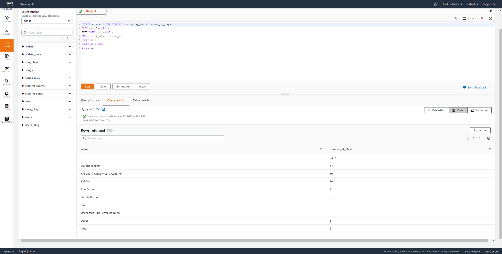
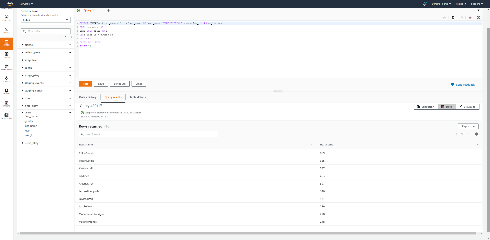

# Project: Sparkify Data Lake with Spark and S3

For this project, I have created an ETL pipeline using Spark and a data lake hosted in S3.
The input data were extracted from an S3 bucket, processed into Analytics (fact and dimensions) tables using Spark and loaded back on a different S3 bucket as parquet files.

# Files

1) dl.cfg - Stores AWS Login Credentials.

2) etl.py - Script that reads, transforms and generates the output files on an S3 bucket

# Instructions

1) Create an AWS S3 bucket and add the AWS login credentials to the dl.cfg file.

2) Execute the etl.py in your terminal to start the ETL process.

# Examples of Analytics Queries

